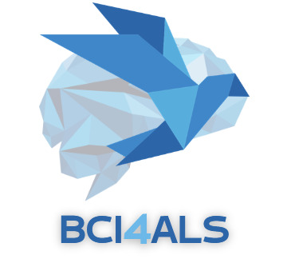

# BCI4ALS-TEAM1
<!-- PROJECT SHIELDS -->
<!--
*** I'm using markdown "reference style" links for readability.
*** Reference links are enclosed in brackets [ ] instead of parentheses ( ).
*** See the bottom of this document for the declaration of the reference variables
*** for contributors-url, forks-url, etc. This is an optional, concise syntax you may use.
*** https://www.markdownguide.org/basic-syntax/#reference-style-links
-->
[![Contributors][contributors-shield]][contributors-url]
[![Forks][forks-shield]][forks-url]
[![Stargazers][stars-shield]][stars-url]
[![Issues][issues-shield]][issues-url]
[![In][linkedin-shield]][linkedin-url]


<!-- PROJECT LOGO -->
<br />
<p align="center">
  <a href="https://github.com/Erezabutbul/BCI4ALS-TEAM1">
    
  </a>

  <h3 align="center">BCI - 4 - ALS</h3>

  
</p>


<!-- TABLE OF CONTENTS -->
<details open="open">
  <summary>Table of Contents</summary>
  <ol>
    <li>
      <a href="#about-the-project">About The Project</a>
      <ul>
        <li><a href="#built-with">Built With</a></li>
      </ul>
    </li>
    <li>
      <a href="#getting-started">Getting Started</a>
      <ul>
        <li><a href="#prerequisites">Prerequisites</a></li>
        <li><a href="#installation">Installation</a></li>
      </ul>
    </li>
    <li><a href="#usage">Usage</a></li>
    <li><a href="#roadmap">Roadmap</a></li>
    <li><a href="#contributing">Contributing</a></li>
    <li><a href="#license">License</a></li>
    <li><a href="#contact">Contact</a></li>
    <li><a href="#acknowledgements">Acknowledgements</a></li>
  </ol>
</details>


<!-- ABOUT THE PROJECT -->
## About The Project

In the previous years of the course, other paradigms were used together with the BCI system, paradigms more active than the P300. Although, for our mentor the main need has always been communication. The need to communicate even in the later stages of the disease was the main motivation for our current product - a BCI system for predicting yes or no answers.

The P300 paradigm can be constructed from one, two or three stimuli. Because we wanted the ability to distinguish between answering yes and no questions, we used a three-stimulus paradigm. So that one stimulus will be the base, and the other two stimuli will help distinguish between yes and no.

After the meeting with the mentor, it was decided to change the stimuli to pictures of their pets. They also expressed to us the difficulty of concentrating for a long time on the screen and requested that there be additional non-visual stimulation. Therefore, we added an auditory stimulus that matches the visual stimuli (dog and cat sounds for the different targets, when the baseline is soundless).

Now the interface is adapted to the parameters of our mentor, when the stimuli appear on a blank screen and a sound is heard for each purpose. In the training mode, the target is shown on the screen of each block, and in the test mode, the stimulus on which one should focus on corresponds to each answer (yes/no). At the end of the test mode, the received answer is printed.


### Built With

* [psychopy](https://www.psychopy.org/)
* [MNE-features](https://mne.tools/mne-features)
* [Keras](https://keras.io/)
* [scikit-learn](https://scikit-learn.org/)


<!-- GETTING STARTED -->
## Getting Started

To get a local copy up and running follow these simple example steps.

### Prerequisites

* [python v. 3.6 or above](https://www.python.org/downloads/)
* [OpenBCI GUI (recommended)](https://openbci.com/index.php/downloads)


### Installation


1. Install python modules
   ```sh
   pip install bci4als

   ```


<!-- USAGE EXAMPLES -->
## Usage

For more examples, please refer to the [examples][examples-url]


<!-- CONTRIBUTING -->
## Contributing

Contributions are what make the open source community such an amazing place to be learn, inspire, and create. Any contributions you make are **greatly appreciated**.

1. Fork the Project
2. Create your Feature Branch (`git checkout -b feature/AmazingFeature`)
3. Commit your Changes (`git commit -m 'Add some AmazingFeature'`)
4. Push to the Branch (`git push origin feature/AmazingFeature`)
5. Open a Pull Request


<!-- CONTACT -->
## Contact

Erez abutbul - [abuerez@post.bgu.ac.il ](mailto:abuerez@post.bgu.ac.il )

Nadav Dvir - [nadavdv@post.bgu.ac.il](mailto:nadavdv@post.bgu.ac.il)

Nofar yarimi - [nofarya@post.bgu.ac.il](mailto:nofarya@post.bgu.ac.il)

Eden or - [edenzo@post.bgu.ac.il](edenzo@post.bgu.ac.il)


Project Link: [https://github.com/Erezabutbul/BCI4ALS-TEAM1](https://github.com/Erezabutbul/BCI4ALS-TEAM1)


<!-- ACKNOWLEDGEMENTS -->
## Acknowledgements


<!-- MARKDOWN LINKS & IMAGES -->
<!-- https://www.markdownguide.org/basic-syntax/#reference-style-links -->
[contributors-shield]: https://img.shields.io/github/contributors/Erezabutbul/BCI4ALS-TEAM1.svg?style=for-the-badge
[contributors-url]: https://github.com/Erezabutbul/BCI4ALS-TEAM1/graphs/contributors
[forks-shield]: https://img.shields.io/github/forks/Erezabutbul/BCI4ALS-TEAM1.svg?style=for-the-badge
[forks-url]: https://github.com/Erezabutbul/BCI4ALS-TEAM1/network/members
[stars-shield]: https://img.shields.io/github/stars/Erezabutbul/BCI4ALS-TEAM1.svg?style=for-the-badge
[stars-url]: https://github.com/evyatarluv/BCI-4-ALS/stargazers
[issues-shield]: https://img.shields.io/github/issues/Erezabutbul/BCI4ALS-TEAM1.svg?style=for-the-badge
[issues-url]: https://github.com/Erezabutbul/BCI4ALS-TEAM1/issues
[linkedin-shield]: https://img.shields.io/badge/-LinkedIn-black.svg?style=for-the-badge&logo=linkedin&colorB=555
[linkedin-url]: https://www.linkedin.com/in/erez-abutbul-82773b21a/
[product-screenshot]: images/screenshot.png
[docs-url]: https://github.com/Erezabutbul/BCI4ALS-TEAM1


